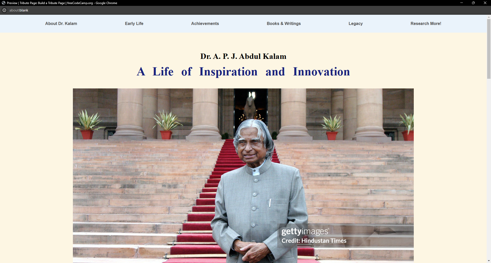
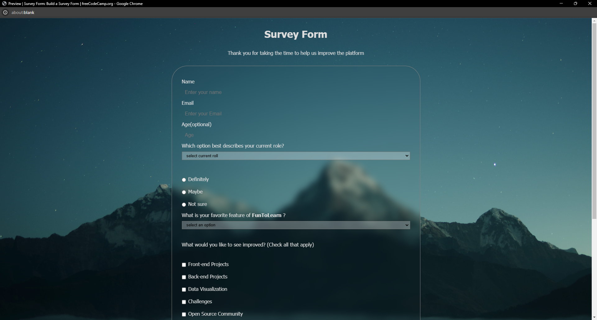
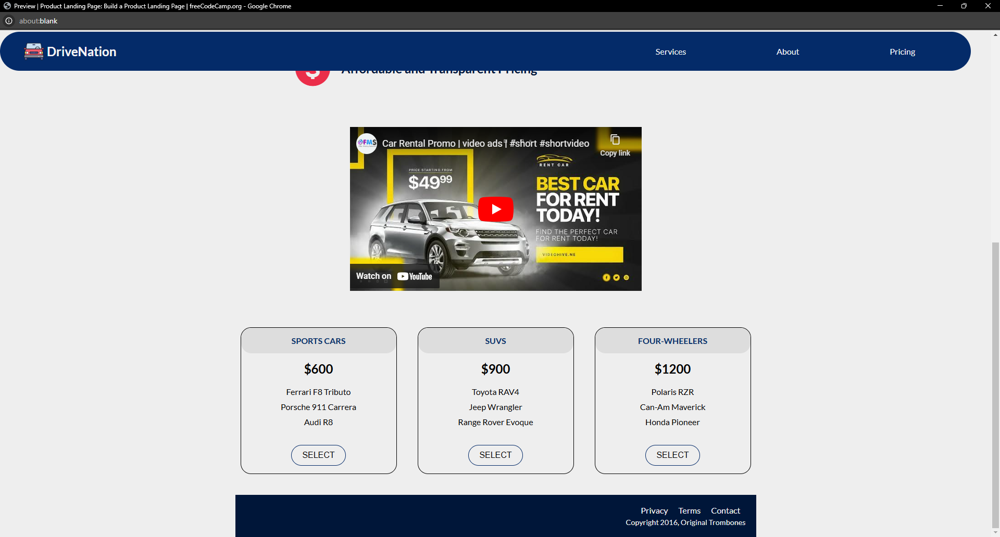
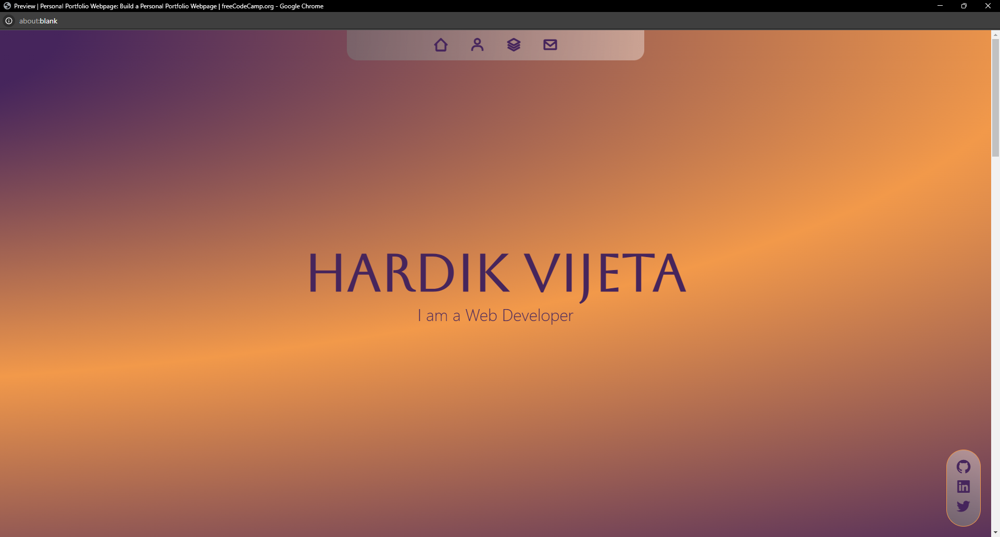

# Responsive Web Design Certification Projects

This repository contains **five projects** completed as part of the freeCodeCamp **Responsive Web Design Certification** program. Each project demonstrates a unique aspect of responsive web design, adhering to the principles taught in the certification. All projects are available for viewing on GitHub.

## 📂 Projects Overview

### 1. **Tribute Page**
   - 
   - **Description:** A simple, responsive webpage dedicated to a historical or influential figure.
   - **Technologies Used:** HTML5, CSS3
   - **GitHub Code:** [Tribute Page Folder](./Tribute%20Page/)

### 2. **Survey Form**
   - 
   - **Description:** A responsive survey form designed to collect user feedback or data.
   - **Technologies Used:** HTML5, CSS3
   - **GitHub Code:** [Survey Form Folder](./Survey%20Form/)

### 3. **Product Landing Page**
   - 
   - **Description:** A responsive landing page for promoting a product or service.
   - **Technologies Used:** HTML5, CSS3
   - **GitHub Code:** [Product Landing Page Folder](./Product%20Landing%20Page/FreeCodeCamp/)

### 4. **Technical Documentation Page**
   - 
   - **Description:** A responsive webpage presenting technical documentation for a topic.
   - **Technologies Used:** HTML5, CSS3
   - **GitHub Code:** [Technical Documentation Folder](./Technical%20Documentation/)

### 4. **Personal Portfolio Page**
   - 
   - **Description:** A responsive webpage presenting technical documentation for a topic.
   - **Technologies Used:** HTML5, CSS3
   - **GitHub Code:** [Technical Documentation Folder](./Personal%20Portfolio/)


## 🏆 Certification
These projects were developed as part of the **freeCodeCamp Responsive Web Design Certification**, where I gained skills in:
- HTML5 and CSS3 fundamentals
- Building responsive layouts using media queries
- Effective use of flexbox and grid for layout design
- Writing semantic HTML and accessible web pages

## 🚀 How to Use
1. Clone the repository:
   ```bash
   git clone https://github.com/yourusername/responsive-web-design-projects.git
   ```
2. Navigate to any project folder:
   ```bash
   cd project-folder-name
   ```
3. Open `index.html` in your browser to view the project.
### 👨‍💻 Author

- GitHub: [@Hard1stf](https://github.com/Hard1stf)
- Twitter: [@Vijeta_X](https://x.com/Vijeta_X)
- LinkedIn: [Hardik Vijeta](https://www.linkedin.com/in/hardik-vijeta-0a8792217)

## 🌟 Acknowledgments
A big thanks to **freeCodeCamp** for providing an excellent platform to learn web development and enhance practical skills through projects.

---

📌 *Feel free to explore, modify, or use these projects as a reference for your learning journey!*
